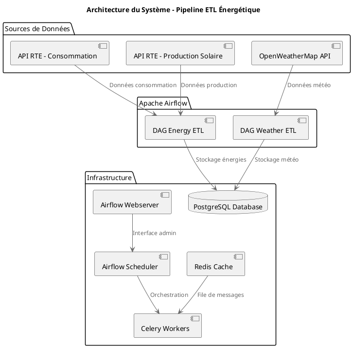

# Projet Titre RNCP - Data Engineer

## Description du Projet

Ce projet implémente un pipeline ETL (Extract, Transform, Load) automatisé pour la collecte et l'analyse de données énergétiques françaises. Il utilise **Apache Airflow** pour orchestrer la collecte quotidienne de données depuis les APIs officielles et stocke les informations dans une base de données PostgreSQL.

### Objectifs
- Collecter les données de **consommation énergétique française** (API RTE)
- Récupérer les données de **production solaire photovoltaïque** (API RTE)  
- Intégrer les **données météorologiques** (OpenWeatherMap)
- Automatiser le traitement et le stockage des données
- Fournir une base de données consolidée pour l'analyse et la prédiction

## Architecture du Système


> **Note** : Remplacez `votre-username` par votre nom d'utilisateur GitHub dans l'URL ci-dessus pour afficher le diagramme.

<details>
<summary>Code PlantUML (cliquer pour voir)</summary>



</details>

### Stack Technique

- **Orchestrateur** : Apache Airflow 2.10.5
- **Base de données** : PostgreSQL 13
- **Cache/Broker** : Redis 7.2
- **Containerisation** : Docker & Docker Compose
- **Langage** : Python 3.x
- **Librairies principales** : pandas, requests, python-dotenv

## Prérequis

### Système
- Docker Engine 20.10+
- Docker Compose 2.0+
- 4GB RAM minimum
- 10GB d'espace disque libre

### Comptes API requis
1. **Compte RTE** : [digital.iservices.rte-france.com](https://digital.iservices.rte-france.com)
   - Application "Consommation" 
   - Application "Génération par filière"
2. **OpenWeatherMap** : [openweathermap.org](https://openweathermap.org/api)

## Configuration et Paramétrage

### 1. Variables d'Environnement

Créez un fichier `.env` à la racine du projet :

```bash
# Configuration Apache Airflow
AIRFLOW_UID=50000
_AIRFLOW_WWW_USER_USERNAME=airflow
_AIRFLOW_WWW_USER_PASSWORD=airflow

# API OpenWeatherMap
METEO_API_KEY=votre_cle_openweathermap
LAT=48.8566          # Latitude Paris
LON=2.3522           # Longitude Paris

# Configuration PostgreSQL (optionnel, utilise les valeurs par défaut)
POSTGRES_USER=airflow
POSTGRES_PASSWORD=airflow
POSTGRES_DB=airflow
```

### 2. Variables Météo (NOUVEAU)

Configurez les variables pour le DAG météo :

#### **Méthode Automatique (Recommandée)**
```bash
# Configuration interactive
./scripts/setup_weather_variables.sh -i

# Configuration directe avec clé API
./scripts/setup_weather_variables.sh -k "votre_cle_api_openweathermap"
```

#### **Méthode Manuelle via Interface Web**
1. Ouvrez `http://localhost:8080`
2. Allez dans **Admin > Variables**
3. Ajoutez :
   - **Key**: `METEO_API_KEY` **Value**: `votre_cle_api`
   - **Key**: `LAT` **Value**: `48.8566` (optionnel, Paris par défaut)
   - **Key**: `LON` **Value**: `2.3522` (optionnel, Paris par défaut)

#### **Obtenir une Clé API Gratuite**
 [OpenWeatherMap API](https://openweathermap.org/api) (gratuit jusqu'à 1000 calls/jour)

### 3. Contrôle d'Accès Base de Données (NOUVEAU)

Configurez un système de sécurité robuste avec rôles et permissions :

#### **Méthode Automatique (Recommandée)**
```bash
# Configuration complète du contrôle d'accès
./scripts/setup_database_access_control.sh

# Test des permissions seulement
./scripts/setup_database_access_control.sh -t

# Génération de rapport seulement
./scripts/setup_database_access_control.sh -r
```

#### **Rôles et Utilisateurs Créés**
| **Utilisateur** | **Rôle** | **Permissions** | **Usage** |
|-----------------|----------|-----------------|-----------|
| `user_etl_airflow` | Admin | Tous droits | DAGs Airflow |
| `user_data_analyst` | Analyste | Lecture 6 mois + vues | Analyse de données |
| `user_readonly` | Lecteur | Lecture 30 jours | Dashboards/monitoring |
| `user_backup` | Backup | Lecture complète | Sauvegardes |

#### **Sécurité Activée**
- **Row Level Security (RLS)** : Accès filtré par période selon le rôle
- **Audit automatique** : Toutes les modifications tracées
- **Vues sécurisées** : Permissions granulaires par rôle
- **Fonctions de maintenance** : Changement mot de passe, nettoyage audit

### 4. Connexions Airflow

Après le démarrage d'Airflow, configurez les connexions via l'interface web (`http://localhost:8080`) :

####  Connexion RTE API
- **Connection Id** : `rte_api`
- **Connection Type** : `HTTP`
- **Host** : `digital.iservices.rte-france.com`
- **Extra** (format JSON) :
```json
{
  "CLIENT_ID": "votre_client_id_consommation",
  "CLIENT_SECRET": "votre_client_secret_consommation",
  "CLIENT_ID_2": "votre_client_id_generation",
  "CLIENT_SECRET_2": "votre_client_secret_generation"
}
```

#### Connexions PostgreSQL Sécurisées (Créées Automatiquement)
- **postgres_etl** : Pour les DAGs ETL (user_etl_airflow)
- **postgres_backup** : Pour les sauvegardes (user_backup) 
- **postgres_readonly** : Pour lecture seule (user_readonly)
- **postgres_default** : Connexion historique (airflow)

## Installation et Déploiement

### 1. Cloner le Projet
```bash
git clone <votre-repo>
cd projet_titre_rncp_data_engineer
```

### 2. Configuration
```bash
# Créer le fichier .env
cp .env.example .env
# Éditer .env avec vos clés API
```

### 3. Démarrage des Services
```bash
# Démarrage complet
docker-compose up -d

# Vérifier les logs
docker-compose logs -f

# Accéder à l'interface Airflow
# http://localhost:8080 (airflow/airflow)
```

### 4. Configuration Post-Installation
1. Se connecter à Airflow : `http://localhost:8080`
2. Configurer les connexions (voir section Paramétrage)
3. Activer les DAGs dans l'interface
4. Vérifier les premiers runs

## Structure des DAGs

### DAG Energy ETL (`api_etl_dag`)
**Fréquence** : Quotidienne (`@daily`)

**Pipeline** :
```
Début → Extraction → Transformation → Chargement → Fin
         ├─ Consommation RTE
         └─ Production Solaire RTE
```

**Tables créées** :
- `energies` : timestamp, Consommations (MW), Production_PV (MW)

### DAG Weather ETL (`weather_dag`)  
**Fréquence** : Horaire (`@hourly`)

**Pipeline** :
```
Début → Extraction → Transformation → Stockage → Fin
        OpenWeatherMap
```

**Tables créées** :
- `meteo` : timestamp, Temperature (°C)

## APIs Utilisées

### 1. API RTE (Réseau de Transport d'Électricité)

#### Consommation Énergétique
- **Endpoint** : `/open_api/consumption/v1/short_term`
- **Données** : Consommation électrique réalisée en France
- **Granularité** : 15 minutes
- **Format** : JSON

#### Production Solaire
- **Endpoint** : `/open_api/actual_generation/v1/actual_generations_per_production_type`
- **Données** : Production par filière (focus solaire photovoltaïque)
- **Granularité** : 15 minutes  
- **Format** : JSON

### 2. OpenWeatherMap API
- **Endpoint** : `/data/2.5/weather`
- **Données** : Météo actuelle (température, humidité, pression, vent)
- **Fréquence** : Temps réel
- **Format** : JSON

## Base de Données

### Table `energies`
```sql
CREATE TABLE energies (
    timestamp TIMESTAMP PRIMARY KEY,
    Consommations FLOAT NOT NULL CHECK (Consommations >= 0),
    Production_PV FLOAT NOT NULL CHECK (Production_PV >= 0),
    created_at TIMESTAMP DEFAULT CURRENT_TIMESTAMP
);
```

### Table `meteo`
```sql
CREATE TABLE meteo (
    timestamp TIMESTAMP PRIMARY KEY,
    Temperature FLOAT
);
```

## Monitoring et Observabilité

### Interface Airflow
- **Web UI** : `http://localhost:8080`
- **Monitoring** : Statut des DAGs, logs, métriques
- **Gestion** : Retry, pause/unpause, visualisation des graphiques

### Logs
```bash
# Logs généraux
docker-compose logs

# Logs spécifiques
docker-compose logs airflow-scheduler
docker-compose logs airflow-worker
```

### Base de Données
```bash
# Connexion PostgreSQL
docker-compose exec postgres psql -U airflow -d airflow

# Vérification des données
SELECT COUNT(*) FROM energies;
SELECT * FROM meteo ORDER BY timestamp DESC LIMIT 10;
```

### Surveillance Sécurité
```bash
# Voir les connexions actives par utilisateur
docker-compose exec postgres psql -U airflow -d airflow -c "SELECT * FROM active_connections;"

# Consulter l'audit de sécurité (7 derniers jours)
docker-compose exec postgres psql -U airflow -d airflow -c "SELECT * FROM security_audit_summary;"

# Vérifier les permissions par rôle
docker-compose exec postgres psql -U airflow -d airflow -c "SELECT table_name, privilege_type, grantee FROM information_schema.table_privileges WHERE table_schema = 'public' AND grantee LIKE '%energie%';"

# Tester l'accès avec un utilisateur spécifique
docker-compose exec postgres psql -U user_readonly -d airflow -c "SELECT COUNT(*) FROM daily_energy_summary;"
```

## Maintenance

### Mise à jour des Dépendances
```bash
# Rebuild avec nouvelles dépendances
docker-compose build --no-cache
docker-compose up -d
```

### Nettoyage
```bash
# Arrêt des services
docker-compose down

# Nettoyage complet 
docker-compose down -v
docker system prune -a
```

### Backup Base de Données
```bash
# Export PostgreSQL
docker-compose exec postgres pg_dump -U airflow airflow > backup_$(date +%Y%m%d).sql

# Restauration
docker-compose exec -T postgres psql -U airflow airflow < backup_20241201.sql
```

## Dépannage

### Problèmes Courants

#### 1. Variables d'environnement météo manquantes
```bash
# ERREUR: Variables d'environnement manquantes: METEO_API_KEY, LAT, ou LON

# SOLUTION: Configurez les variables Airflow
./scripts/setup_weather_variables.sh -i

# OU via interface web:
# http://localhost:8080 → Admin → Variables → Ajouter METEO_API_KEY
```

#### 2. Erreur de Token RTE
```bash
# Vérifier les connexions Airflow
# Régénérer les tokens sur le portail RTE
```

#### 3. Manque de Mémoire
```bash
# Augmenter les ressources Docker
# Minimum 4GB RAM recommandé
```

#### 4. Permissions Airflow
```bash
# Corriger les permissions
sudo chown -R $USER:$USER logs/ dags/ plugins/
```

#### 5. API Météo inaccessible
```bash
# Tester la clé API
curl "https://api.openweathermap.org/data/2.5/weather?lat=48.8566&lon=2.3522&appid=VOTRE_CLE"

# Vérifier les logs DAG pour plus de détails
```

#### 6. Erreurs de permissions base de données
```bash
# ERREUR: permission denied for table energies

# SOLUTION: Vérifier les rôles et permissions
docker-compose exec postgres psql -U airflow -d airflow -c "SELECT * FROM active_connections;"

# Reconfigurer le contrôle d'accès si nécessaire
./scripts/setup_database_access_control.sh

# Tester les permissions par utilisateur
./scripts/setup_database_access_control.sh -t
```

#### 7. Connexions Airflow incorrectes
```bash
# ERREUR: connection 'postgres_etl' doesn't exist

# SOLUTION: Recréer les connexions sécurisées
./scripts/setup_database_access_control.sh

# OU manuellement via interface web:
# http://localhost:8080 → Admin → Connections → Add
```

#### 8. Audit et sécurité
```bash
# Voir qui accède à quoi
docker-compose exec postgres psql -U airflow -d airflow -c "SELECT * FROM security_audit_summary;"

# Changer un mot de passe utilisateur
docker-compose exec postgres psql -U airflow -d airflow -c "SELECT change_user_password('user_readonly', 'nouveau_mot_de_passe_securise!');"

# Nettoyer les logs d'audit anciens (90 jours)
docker-compose exec postgres psql -U airflow -d airflow -c "SELECT cleanup_audit_logs(90);"
```

## Ressources

- [Documentation Apache Airflow](https://airflow.apache.org/docs/)
- [API RTE Documentation](https://digital.iservices.rte-france.com/apis)
- [OpenWeatherMap API](https://openweathermap.org/api)
- [Docker Compose Guide](https://docs.docker.com/compose/)

## Équipe

**Projet Titre RNCP - Data Engineer**  
*Formation Data Engineering*

---

**Support** : Pour toute question technique, consulter les logs Airflow et la documentation des APIs. 

-- ===============================================
-- PARAMÉTRAGE SÉCURISÉ DE LA BASE DE DONNÉES
-- Selon les bonnes pratiques de production
-- ===============================================

-- 1. CONTRÔLE D'ACCÈS PAR RÔLES
-- ===============================================

-- Rôle LECTEUR : Consultation uniquement  
CREATE ROLE lecteur_energie;
GRANT CONNECT ON DATABASE airflow TO lecteur_energie;
GRANT USAGE ON SCHEMA public TO lecteur_energie;
GRANT SELECT ON ALL TABLES IN SCHEMA public TO lecteur_energie;

-- Rôle ANALYSTE : Lecture + requêtes complexes
CREATE ROLE analyste_energie;
GRANT lecteur_energie TO analyste_energie;
GRANT CREATE ON SCHEMA public TO analyste_energie;
GRANT TEMPORARY ON DATABASE airflow TO analyste_energie;

-- Rôle ADMIN : Tous droits (ETL, maintenance)
CREATE ROLE admin_energie;
GRANT ALL PRIVILEGES ON DATABASE airflow TO admin_energie;

-- Création d'utilisateurs avec rôles
CREATE USER etl_user WITH PASSWORD 'secure_etl_2024';
GRANT admin_energie TO etl_user;

CREATE USER data_analyst WITH PASSWORD 'secure_analyst_2024';
GRANT analyste_energie TO data_analyst;

CREATE USER readonly_user WITH PASSWORD 'secure_readonly_2024';
GRANT lecteur_energie TO readonly_user;

-- 2. INDEXATION TEMPORELLE OPTIMISÉE
-- ===============================================

-- Index composites pour performances
CREATE INDEX idx_energies_timestamp_consommation 
    ON energies (timestamp DESC, Consommations);

CREATE INDEX idx_energies_timestamp_production 
    ON energies (timestamp DESC, Production_PV);

-- Index partiel pour données récentes (30 jours)
CREATE INDEX idx_energies_recent 
    ON energies (timestamp DESC) 
    WHERE timestamp >= NOW() - INTERVAL '30 days';

-- Index pour agrégations temporelles
CREATE INDEX idx_energies_hourly 
    ON energies (DATE_TRUNC('hour', timestamp));

-- 3. AUDIT ET SURVEILLANCE
-- ===============================================

-- Table d'audit pour traçabilité
CREATE TABLE audit_log (
    id SERIAL PRIMARY KEY,
    table_name VARCHAR(50) NOT NULL,
    operation VARCHAR(10) NOT NULL,
    user_name VARCHAR(50) NOT NULL,
    timestamp TIMESTAMP DEFAULT NOW(),
    details JSONB
);

-- Fonction de monitoring des performances
CREATE OR REPLACE FUNCTION get_table_stats()
RETURNS TABLE(
    table_name TEXT,
    total_rows BIGINT,
    table_size TEXT,
    index_usage_ratio NUMERIC
) AS $$
BEGIN
    RETURN QUERY
    SELECT 
        schemaname||'.'||tablename as table_name,
        n_tup_ins + n_tup_upd + n_tup_del as total_rows,
        pg_size_pretty(pg_total_relation_size(schemaname||'.'||tablename)) as table_size,
        ROUND(
            CASE 
                WHEN seq_scan + idx_scan = 0 THEN 0
                ELSE (idx_scan::numeric / (seq_scan + idx_scan) * 100)
            END, 2
        ) as index_usage_ratio
    FROM pg_stat_user_tables;
END;
$$ LANGUAGE plpgsql; 